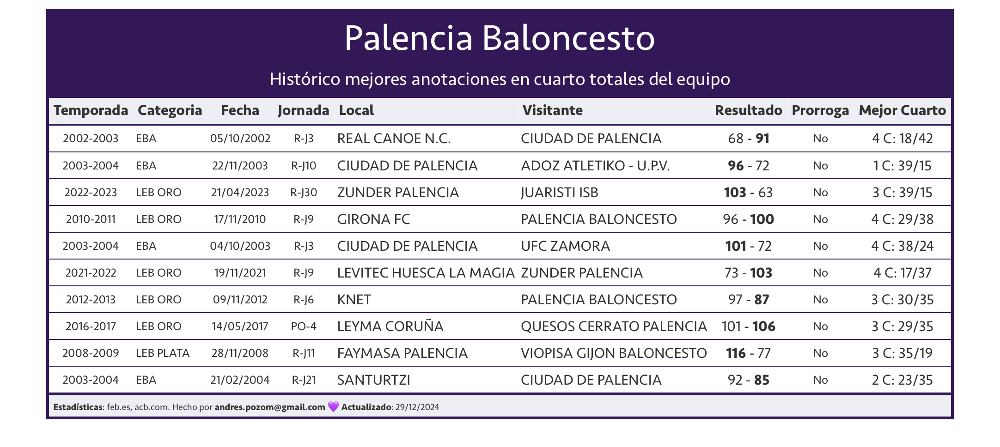
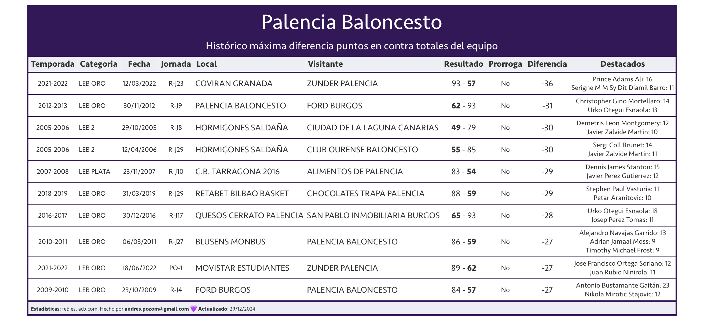
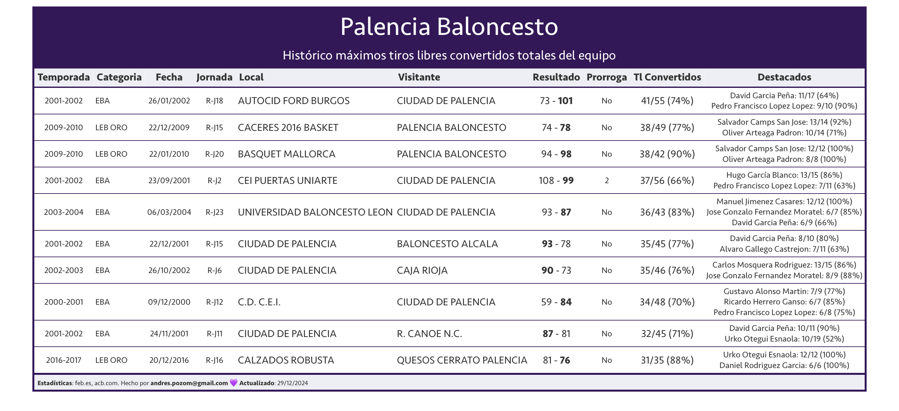
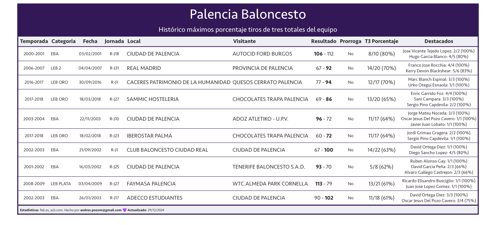
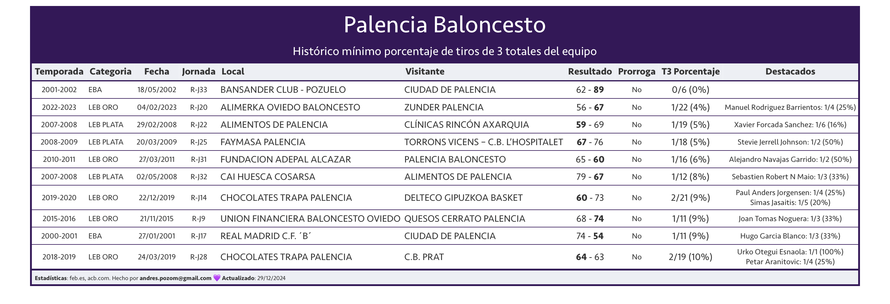
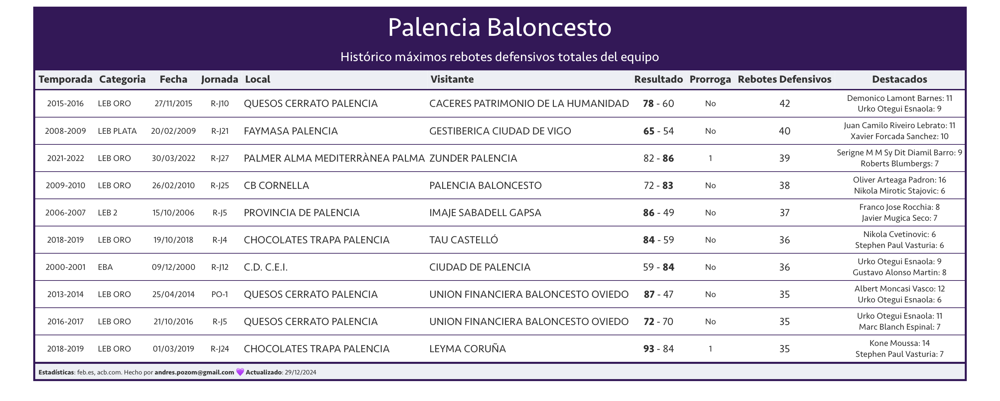
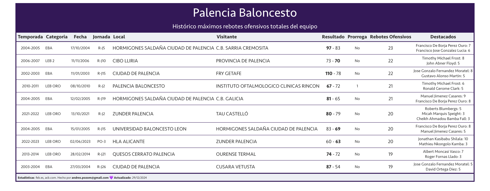
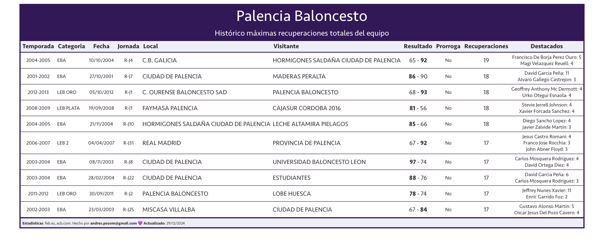

# Records de equipo de Palencia baloncesto

**Nota**: Están disponibles las estadísticas de TODOS los partidos oficiales disputados por [Palencia Baloncesto](https://zunderpalencia.com) EXCEPTO la Jornada 30 de la temporada regular de la temporada 2000-2001 en EBA, [este](https://baloncestoenvivo.feb.es/partido/35797), disputado contra el  C.B. SAN ISIDRO OROTAVA  el 05/05/2001 en La Orotava.

¡Si alguien puede conseguir información(estadísticas) de ese partido se lo agradecería!

## Anotaciones

  

## Valoración

## Tiros de 2

## Tiros libres

# Tiros de 3

# Rebotes

# Asistencias

# Mates

# Pérdidas

# Recuperaciones

# Faltas

 
                